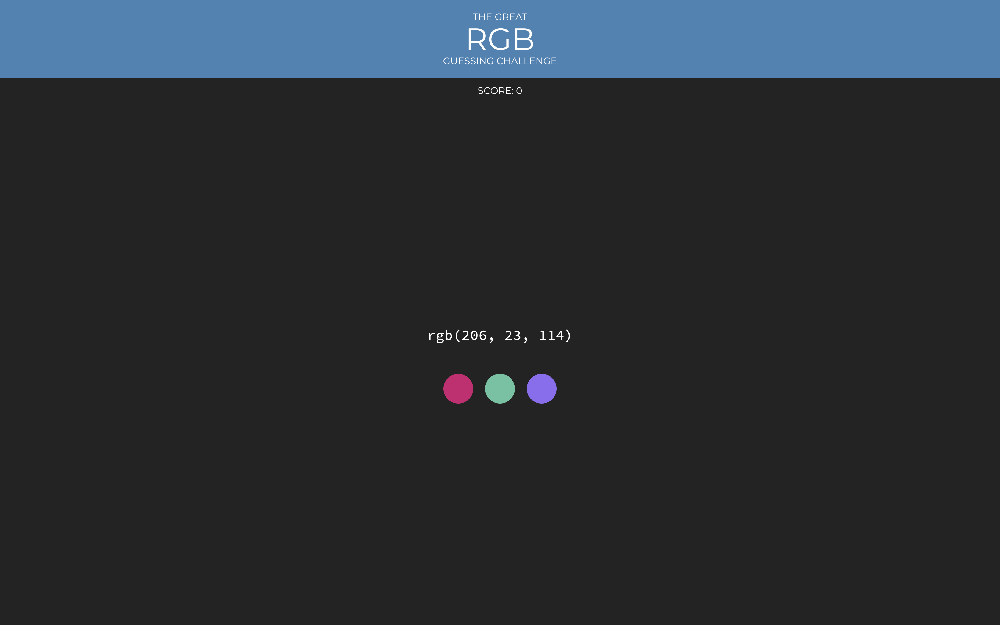
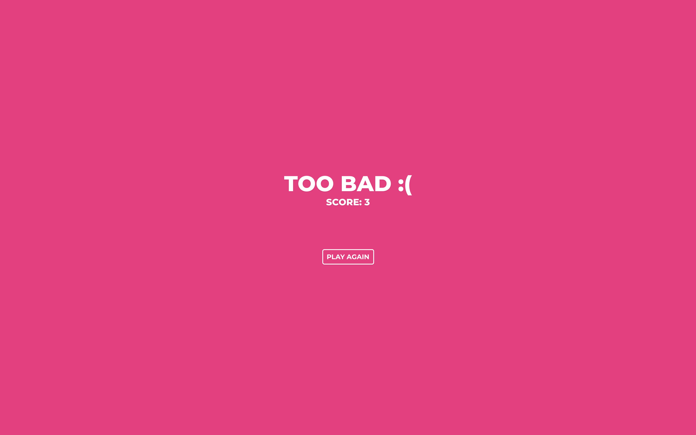

# RGB Challenge

## 소개

화면에 나타난 RGB 코드가 나타내는 색을 추측하는 게임

## 다루는 개념

- JSX: 선언적 렌더링을 위한 자바스크립트 확장 문법
- 컴포넌트
- props: 컴포넌트 간에 데이터 주고 받기
- state: 컴포넌트의 지역 상태 관리하기
- CRA: React 스캐폴딩 도구
- 함수형 컴포넌트와 클래스 컴포넌트
- 합성(Composition) vs 상속(Inheritance)
- CSS 스타일링
  - CSS 모듈: CSS 모듈화하기
  - classnames: CSS 클래스를 동적으로 변경하기
- 조건부 렌더링
- Fragment: 둘 이상의 자식 요소를 wrapper 요소로 감싸지 않고 렌더링하기
- `Array.prototype.map`을 활용한 배열 데이터 렌더링
- state 끌어올리기
